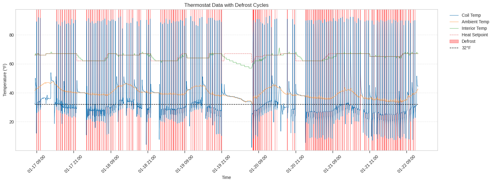
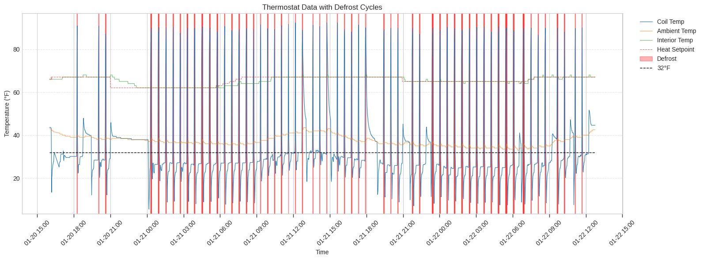

## The Problem
We bought our house in 2020 with an aging gas furnace and AC unit from a previous owner's 2001 remodel. Over the next few years I limped the furnace along by replacing the inducer motor, ignition spark plugs, flame sensor, and doing some creative zip-tie work on the circuit board. By May 2025, it was time to replace everything with a heat pump system before something catastrophically failed and we were left without heat or cooling during an extreme weather event.

The install went smoothly. A Lennox heat pump outside, an air handler in the kitchen closet, and their S40 thermostat to tie it all together. May is a mild month in Portland where heating and cooling demands are usually minimal. As such, we didn't need much heat and cooling was great all summer long.

Then October arrived. The heat pump started running defrost cycles every 30 minutes. When a heat pump heats a house in cold weather, the outdoor coils get cold enough to accumulate frost. The system periodically reverses itself, essentially running as an AC, to melt that frost off. This is normal. Every 30 minutes is not, especially in a mostly mild Portland climate.

The installation company sent a tech out on October 30th. He adjusted the defrost termination temperature to 90 degrees. This setting controls how hot the external heat pump coil must get to complete a defrost cycle. This did nothing to the frequency of defrost cycles, but did increase their duration. Another tech came November 10th and added refrigerant. That helped briefly, reducing the duration of each defrost cycle, but ultimately did nothing to reduce the frequency of the 30-minute defrost cycles. A spate of warm, rainy weather and the holidays in December deprioritized this issue, but by the end of December the problem was ongoing and at the forefront of our minds.

To try to get more of a sense of control of the situation (and to better describe it to technicians), I started keeping a handwritten log of when the defrost kicked on and off. I was also curious about the deeper behavior of the system and the state of the many sensors and input parameters feeding into the firmware running on the heat pump control boards and the thermostat. I wanted to be able to explore the relationships between the data: how hard was the system working to raise the internal temperature to the set point? How long did it take to recover from our nightly setback? Did any of this correlate with the defrost frequency? And I wanted hard data to show the technicians: "here's how we had the system configured, here's what we were asking it to do, here's when it defrosted and for how long."

However, my handwritten log wasn't perfect. I'd miss cycles overnight, and getting the actual sensor values such as coil temperature and heating rate meant navigating through a hidden menu behind a couple of confirmation dialogs marked for "authorized technicians only". As a result, I did this only occasionally, and annoyingly, sometimes in the middle of the night. I needed a better way to capture what the system was doing around the clock.

## The Legwork
The Lennox S40 thermostat can connect to my home Wi-Fi network. Lennox provides a mobile app that talks to their cloud servers, which in turn communicate with the thermostat, enabling remote control of the thermostat system from anywhere with an internet connection. The app lets you adjust temperature and view basic status. However, the app is a closed system and the makers choose to significantly limit the settings and data exposed through the native app. None of the detailed settings, parameters, and sensor diagnostic readings are exposed through the app.

But, I knew the data existed; I could see it on the thermostat itself. And I knew, because of the mobile app, that the thermostat had ways of sharing some live system data over the wifi network. I just needed to figure out if I could communicate with the thermostat directly and if I could retrieve the data I was interested in.

Googling "lennox s40 thermostat api" led me immediately to PeteRager's lennoxs30 library on GitHub. Others in the home automation community had already done the work of reverse-engineering the local API. The library is designed for Home Assistant integration, but the underlying code for communicating with the thermostat was exactly what I needed.

## Exploration

I spent an evening in a Jupyter notebook figuring out how to talk to my thermostat. The lennoxs30 library provides an s30api_async class that handles the connection. Once connected, you receive a list of systems (in my case, just one HVAC system). Each system contains equipment objects and zone objects. The equipment objects represent the physical hardware: the heat pump and the air handler. Each piece of equipment exposes a list of diagnostic parameters.

The diagnostic parameters have names, and those names matched what I'd seen in the thermostat's hidden diagnostics menu. I already knew which values I cared about from weeks of manually checking: coil temperature, ambient temperature, heating rate, defrost status. Finding them programmatically was a matter of printing out the available diagnostics and matching names to what I recognized.

From the heat pump, I pulled the ambient temperature, coil temperature, defrost status, reversing valve state (heat vs cool mode), and the frost accumulation timer. From the air handler, I grabbed the blower CFM, heating rate, and whether the auxiliary heat strips were running. The zone object gave me the current interior temperature and the heating setpoint.

The next morning, I noticed a problem: the values in my log weren't changing. The script ran, data came back, but the coil temperature stayed the same minute after minute. After some digging, I found I needed to call set_diagnostic_level(2) each time the script runs to get fresh sensor readings. Without it, the thermostat returns stale cached values. Adding that call fixed the issue.

## The Script

The final script is straightforward. It connects to the thermostat, sets the diagnostic level, pumps messages until the zones load, then grabs the values I care about and appends them to a CSV file.

```python
import asyncio
from lennoxs30api import s30api_async
from datetime import datetime
from pathlib import Path

IP_ADDRESS = "{IP_ADDRESS}"
LOG_FILE = Path(__file__).parent / "thermostat_log.csv"

# Heat pump diagnostic IDs
HP_DEFROST_STATUS = 4
HP_HEATING_RATE = 2
HP_REVERSING_VALVE = 5
HP_AMBIENT_TEMP = 9
HP_COIL_TEMP = 10
HP_TARGET_FROST_ACCUM_MIN = 11
HP_FROST_ACCUM_MIN = 12

# Air handler diagnostic IDs
AH_DEFROST_STATUS = 15
AH_HEATING_RATE = 0
AH_ELEC_HEAT_SECTIONS = 13
AH_BLOWER_CFM = 1

HEADER = (
    "timestamp,interior_temp,hsp,csp,defrost_status,heating_rate,"
    "reversing_valve,ambient_temp,coil_temp,target_frost_accum_min,"
    "frost_accum_min,ah_defrost_status,ah_heating_rate,"
    "ah_elec_heat_sections,ah_blower_cfm\n"
)

async def get_status():
    api = s30api_async(
        username="", password="", app_id="test_app", ip_address=IP_ADDRESS
    )
    await api.serverConnect()
    try:
        for system in api.system_list:
            await api.subscribe(system)
        await system.set_diagnostic_level(2)

        for _ in range(60):
            await api.messagePump()
            if system.zone_list:
                break

        if not system.zone_list:
            raise TimeoutError("Zones never loaded after 60 pumps")

        zone = system.zone_list[0]
        hp_diags = system.equipment[1].diagnostics
        ah_diags = system.equipment[2].diagnostics

        timestamp = datetime.now().strftime('%Y-%m-%d %H:%M:%S')
        hp_diags_to_log = [
            HP_DEFROST_STATUS, HP_HEATING_RATE, HP_REVERSING_VALVE,
            HP_AMBIENT_TEMP, HP_COIL_TEMP,
            HP_TARGET_FROST_ACCUM_MIN, HP_FROST_ACCUM_MIN
        ]
        ah_diags_to_log = [
            AH_DEFROST_STATUS, AH_HEATING_RATE,
            AH_ELEC_HEAT_SECTIONS, AH_BLOWER_CFM
        ]

        values = [timestamp, zone.temperature, zone.hsp, zone.csp]
        values += [hp_diags[did].value for did in hp_diags_to_log]
        values += [ah_diags[did].value for did in ah_diags_to_log]

        with open(LOG_FILE, "a") as f:
            f.write(",".join(str(v) for v in values) + "\n")
    finally:
        await api.shutdown()


if __name__ == "__main__":
    if not LOG_FILE.exists():
        with open(LOG_FILE, "a") as f:
            f.write(HEADER)
    try:
        asyncio.run(get_status())
    except Exception as e:
        with open(LOG_FILE, "a") as f:
            f.write(f"{datetime.now()}: Error: {e}\n")
```

I run this via cron every minute. Each run appends one row to the CSV. The setup is low-tech: a laptop that stays awake (thanks to `caffeinate` on macOS) with a single crontab entry:

```
* * * * * /path/to/venv/bin/python /path/to/thermologger.py
```

I don't intend to run this logger for an extended period of time. Hopefully we get a resolution from the HVAC company who installed the system soon. If this was a longer term log, I'd move it to the Raspberry Pi that's gathering dust in the closet or use this as an excuse to actually jump into the homelab rabbit hole. As it exists now, it was easier to just run it off the laptop.

The full code is available on [Github](https://github.com/xander-harris/thermologger/).

## Gotchas

Beyond the diagnostic level issue mentioned earlier, I ran into one other quirk. The library uses a `messagePump()` function to process responses from the thermostat. The zone data I needed (interior temperature, setpoints) doesn't populate immediately after connecting; it takes multiple pump cycles for the thermostat to send everything. Through trial and error, I found the zones reliably loaded after about 56 pumps regardless of how much wall-clock time I added between them. I settled on a loop that runs up to 60 pumps and breaks early once the zone list populates.

For reliability, I wrapped the main work in a try/finally block so that `api.shutdown()` always runs, even if something fails mid-script. The outer try/except catches any remaining errors and logs them with a timestamp. Running as a cron job every minute means a single failure just leaves a gap in the log rather than crashing a long-running process. Over five days of minute-by-minute logging, I've had exactly three failures — all recovered on the next run.

## Graphs

With data in hand, I wrote a quick matplotlib script to visualize what the system was doing: 

```python
import pandas as pd
import matplotlib.pyplot as plt
from matplotlib.dates import HourLocator, DateFormatter

df = pd.read_csv('./thermostat_log.csv', parse_dates=['timestamp'])
df['is_defrost'] = (df['defrost_status'] == 'Active') &
                   (df['reversing_valve'] == 'Cool Mode')

fig, ax = plt.subplots(figsize=(16, 6))

ax.plot(df['timestamp'], df['coil_temp'], label='Coil Temp', linewidth=0.8)
ax.plot(df['timestamp'], df['ambient_temp'], label='Ambient Temp', linewidth=0.8, 
        alpha=0.7)
ax.plot(df['timestamp'], df['interior_temp'], label='Interior Temp', linewidth=0.8,
        alpha=0.7)
ax.plot(df['timestamp'], df['hsp'], label='Heat Setpoint', linewidth=0.8,
        linestyle='--', alpha=0.7)

for i, t in enumerate(df[df['is_defrost']]['timestamp']):
    ax.axvspan(t, t + pd.Timedelta(minutes=1), alpha=0.3, color='red',
    label='Defrost' if i == 0 else '')

ax.hlines(y=32, xmin=df['timestamp'].min(), xmax=df['timestamp'].max(),
         color='black', linewidth=1, linestyle='--', label='32°F')

ax.set_ylim(bottom=min(30, df['coil_temp'].min() - 2))
ax.set_xlabel('Time')
ax.set_ylabel('Temperature (°F)')
ax.set_title('Thermostat Data with Defrost Cycles')
ax.legend(loc='upper left', bbox_to_anchor=(1.02, 1))
ax.grid(axis='y', linestyle='--', alpha=0.5)

ax.xaxis.set_major_locator(HourLocator(interval=12))
ax.xaxis.set_major_formatter(DateFormatter('%m-%d %H:%M'))

ax.tick_params(axis='x', labelsize=10, length=6, width=1)
plt.xticks(rotation=45)

plt.tight_layout()
plt.show()
```

The graph plots four temperature lines: the coil temperature (blue), ambient outdoor temperature (orange), interior temperature (green), and the heating setpoint (dashed). A horizontal black line marks 32°F for reference. Red vertical bands highlight each defrost cycle.

The defrost pattern is immediately visible: a forest of red lines spaced exactly 30 minutes apart, regardless of conditions. The coil temperature dips into the teens during heating, spikes during defrost as the system briefly runs in cooling mode, then drops again. The interior temperature shows our overnight setback and morning recovery. The ambient temperature hovers in the high 30s to low 40s — cold enough for the heat pump to work, but not cold enough to justify defrosting every half hour, especially during the dry weather we've had.



The large blank space overnight on the 19th into the morning of the 20th represents a night where we turned the system off entirely because the frequent defrost cycles were repeatedly waking us up while we slept. Outside of the sleep disruption, particularly galling are the mid-day periods on the 18th and 19th where the interior temperature is maintaining the set point and the ambiant temperature is above 40°F, but defrost cycles persist every 30 minutes.

In an attempt to reduce the variables for the HVAC techs to troubleshoot, I reset the thermostat to factory defaults on the afternoon of the 20th. Below is a graph of nearly two days of data after the thermostat reset.



After reset, the system quickly raised the house temperature back to the setpoint and then held it there with very few defrost cycles. The thermostat followed the programmed schedule and dropped the setpoint from the daily 67 to the overnight 62 at 21:00 and the heat pump did not need to run until shortly after midnight when the internal temperature had reached 62. At that point, the pattern of 30 minute defrost cycles returned and continued. In an effort to see if a smaller overnight setback would help, I set the thermostat to 65 overnight on the 21st into the 22nd. However, that made no difference.

Having these visuals made the problem concrete in a way that "it defrosts a lot" never could.

## What's Next

A technician came out on January 22nd. He worked through his checklist: thermostat settings, filter condition, refrigerant levels. Then he ran the unit at 100% in test mode. We watched the coil temperature reading drop to 12°F almost immediately, even though the ambient air was in the low 40s. We checked the outdoor coils — no frost. A few minutes later, the coil temperature reading had risen to 18°F, then 33°F, while still running full heat. That's backwards. The coil should get colder under load, not warmer.

After 30 minutes of running at full capacity with no visible frost accumulation, the unit defrosted anyway. The tech's conclusion: something is wrong with the coil temperature sensor or the control board interpreting its readings. The system is defrosting based on bad data.

His next step is to call Lennox technical support. He mentioned his last call involved a 90-minute hold. I'm waiting to hear back.

Ironically, I never shared the logged data or graphs with this latest technician. He seemed more than willing to believe the behavior I was describing and then was able to witness it himself and those observations point towards faulty temperature data. As I mentioned above, I think this is a hardware issue and don't want to confuse the situation if someone looks at my work and thinks I broke something by "hacking" my thermostat.

I'll write a follow-up post once we have a resolution. In the meantime, I'll keep the script collecting data. I probably won't do anything with it now that everyone is convinced of the problem.